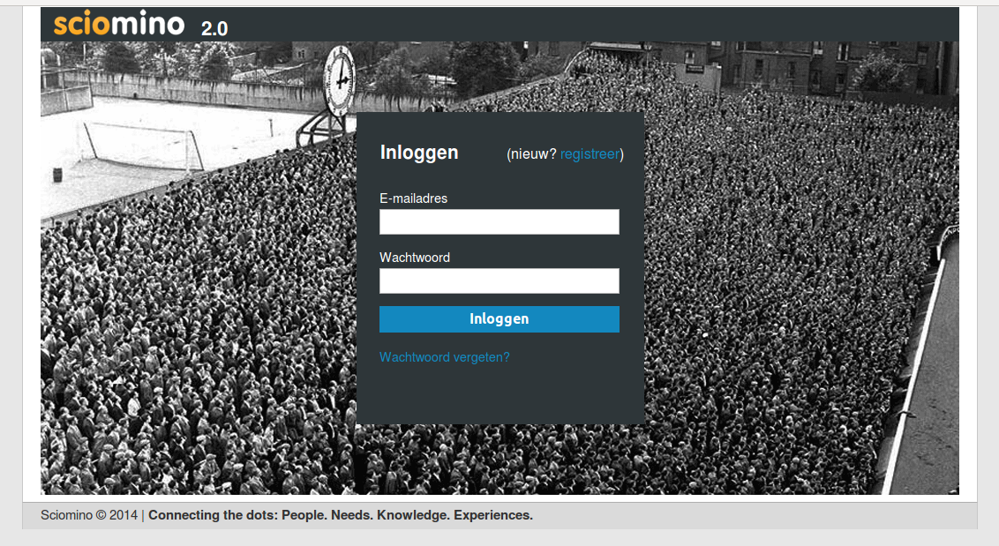
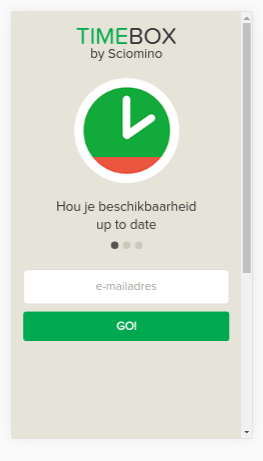
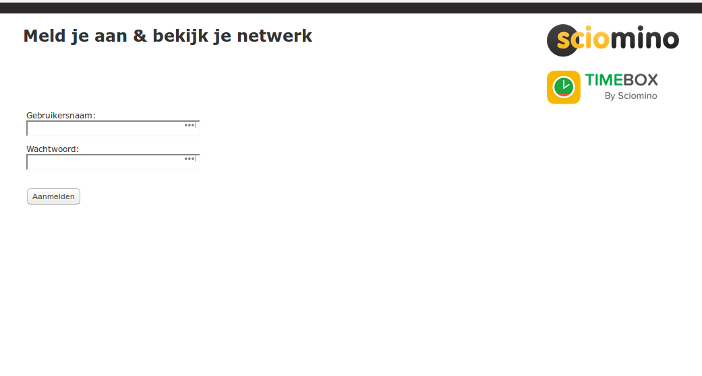

```html
<h1>Welkom</h1>

<p>Dit is de repository van Sciomino & Timebox. Sciomino is een kennismanagement product (marktplaats voor kennis) dat van 2010 tot 2016 actief is geweest. Timebox is een app voor het bijhouden van beschikbaarheid van flexwerkers die van 2014 tot 2016 als add-on op het sciomino platform is aangeboden.</p>

<p>In deze repository vind je een bundeling van de code van deze twee producten. Het platform bestaat uit 8 verschillende onderdelen:</p>
<ul>
<li> sciomino1.2 (de frontend van sciomino tot 2014)
<li> sciomino2.0 (de frontend van sciomino vanaf 2014, inclusief timebox)
<li> sciomino-api (de sciomino user api)
<li> sciomino-answers (de sciomino answers api)
<li> sciomino-connect (de sciomino connect api)
<li> sciomino-graph (de statistieken viewer op sciomino frontends + het timebox dashboard)
<li> timebox-api (de timebox api, availability)
<li> timebox-app (de timebox app)
</ul>

<p>Alle code is geschreven als plugin op een framework, genaamd xcow. Dit framework is vanaf 2000 gebruikt door Herman om websites op te ontwikkelen met een gemeenschapplijke broncode. Merk op dat dit framework verouderd is.</p>

<p>Je ziet in ieder deel dezelfde structuur van code terugkomen, de specifieke code voor de sciomino onderdelen staan in de /plugin directories. De mappen zijn:</p>
<ul>
<li>data, de code
<ul>
<li>control, de controller
<li>etc, configuratie
<li>extension, extra code (indien aanwezig)
<li>language, taal files
<li>lib, veel gebruikte code in aparte libraries
<li>model, de bewerking van de code
<li>test, unittest (indien aanwezig)
<li>view, de presentatie van de code
</ul>
<li>docs, de uitleg
<li>export, export van code
<li>htdocs, de webroot
<li>license
<li>plugin, de directory voor add-ons
<ul>
<li>vaak zelfde structuur als data
</ul>
<li>save, de schrijfbare directory met log files etc
<li>scripts, non-web code, zoals databases en cron
<li>version
</ul>

<p><b>Note</b>: Sciomino is een multitenant platform. Er is een (1) instantie nodig van de achterliggende code, waar meerdere frontends op kunnen draaien. Hoe dit platform getweaked en getuned kan worden wordt hier niet uitgelegd, dat is aan de lezer, het is ook niet toegestaan deze code commercieel te gebruiken. <b>WEL</b> wordt hier verteld hoe het hele platform op een eigen server is te installeren, voor eigen gebruik.</p>

<h1>Server requirements</h1>

<p>De code heeft altijd gedraaid op een LAMP stack, Linux, Apache, Mysql & PHP. De requirements zijn:</p>
<ul>
<li> Ubuntu 12.04
(let op: het systeem moet kunnen mailen)
<li> Apache 2 (let op: rewrite rules moeten het doen)
<li> mysql 5.5
<li> php 5
</ul>

<p>De app is een hybride app, gemaakt in HTML, JavaScript en CSS die met een aantal cordova/phonegap plugins uitgebreid kan worden tot een volwaardige app die geplaatst kan worden in de Apple app store en de Google play store.</p>

<h1>Install</h1>

<p>
<b>stap 1</b>
<br/>
Als de server requirements geinstalleerd zijn, maak dan de root directory aan voor de install van de code: <b>/var/www-virtual</b>
<br/>
<pre>mkdir /var/www-virtual</pre>
</p>

<p>
<b>stap 2</b>
<br/>
Download deze github repository en zet alles in /var/www-virtual/sciomino
<br/>
<pre></pre>
</p>

<p>
<b>stap 3</b>
<br/>
Nu even de urls op het systeem klaarzetten. In de file /var/www-virtual/sciomino/install/linux/hosts staan de hosts die je toe kunt voegen aan /etc/hosts
<br/>
<pre>cat /var/www-virtual/sciomino/install/linux/hosts >> /etc/hosts</pre>
</p>

<p>
<b>stap 4</b>
<br/>
Apache configureren. In de directory /var/www-virtual/sciomino/install/apache staan de hosts files die bij de verschillende sites horen. Die kun je kopieren naar /etc/apache2/sites-available en dan actief maken in apache.
<br/>
<pre></pre>
</p>

<p>
<b>stap 5a</b>
<br/>
Mysql configureren. In de directory /var/www-virtual/sciomino/install/mysql staat een file: setup.sql, die de databases en een eigen user met wachtwoord (sciomino:timebox) aanmaakt. Deze sql kun je als de mysql root user inlezen.
<br/>
<pre>mysql -u root -p < setup.sql</pre>
</p>

<p>
<b>stap 5b</b>
<br/>
Mysql configureren. In de directory /var/www-virtual/sciomino/install/mysql/data & tables staan datafiles die de databases vullen met de benodigde initiele data. Deze  kun je (na stap 5a) inlezen met het script setup_data.sh. 
<br/>
<pre>./setup_data.sh</pre>
</p>

<p>
<b>stap 5c, optioneel</b>
<br/>
Mysql configureren. Als je plaatsnamen op kaarten wilt zien, dan moet de geo data ingelezen worden in de connect api. In de file /var/www-virtual/sciomino/install/mysql/geodata_20130411.sql.gz staat deze data. Deze moet je dan uitpakken met gunzip en inlezen met het script setup_geo.sh. 
<br/>
<pre>
gunzip geodata_20130411.sql.gz
./setup_geo.sh</pre>
</p>

<p>
<b>stap 6</b>
<br/>
crontabs aanzetten. In de file /var/www-virtual/sciomino/install/linux/crontab staan de crontab entries die bij de verschillende sites horen. Crontabs worden gebruikt voor update van de zoekindex, updaten van de statistieken en versturen van dagelijkse mailtjes etc. De entries kun je kopieren in de echte crontab.
<br/>
<pre>crontab -e</pre>
</p>

<h1>Let's go!</h1>
<h2>Sciomino</h2>

<p>Nu kun je browsen naar http://sciomino12/ en http://sciomino20/ om kennis te delen! Maak een account aan en enjoy.</p>


<h2>Timebox</h2>
<p>Heb je een user aangemaakt in Sciomino? Dan kun je ook Timebox gaan proberen. Dit vergt 1 install stapje nog.</p>

<p>
<b>stap 5d</b>
<br/>
Mysql configureren. In de directory /var/www-virtual/sciomino/install/mysql/data staan ook datafiles die de databases vullen met een initieel timebox netwerk (genaamd timebox). Deze  kun je nu inlezen met het script: setup_network.sh. (btw: deze install stap staat hier omdat hiervoor user met id=1 nodig is in sciomino20)
<br/>
<pre>./setup_network.sh</pre>
</p>

<p>Voor een preview van de app ga je naar http://timebox-app/. Dit is de webversie van de app. De hybride/appstore versie kan vanuit deze code gemaakt worden, die staat klaar in de map: /var/www-virtual/sciomino/timebox-app/APP/sciomino-timebox. Deze map kan in een cordova project gehangen worden.</p>


<h2>Statistieken</h2>

<p>Voor Sciomino statistieken of het Timebox dashboard ga je naar http://sciomino-graph/. Login met gebruikersnaam 'sciomino' en wachtwoord 'timebox'.</p>


<h1>Zelf nog wat aanpassen?</h1>

<p>1. Bekijk dan eens deze configuratie files:</p>
<ul>
<li> data/etc/xcow_base.ini is de algemene config file, beschikbaar voor ieder raamwerk
<li> plugin/sciomino/data/etc/sciomino.ini is de specifieke frontend config file, alleen beschikbaar voor de twee frontends
<li> plugin/sciomino/data/control/sciomino.ini is de controller voor de frontend, daarin staan alle urls die aanroepbaar zijn
</ul>

<p>2. Bekijk ook de log files:</p>
<ul>
<li> save/logs/xcow_base.log is de algemene log file, beschikbaar voor ieder raamwerk
</ul>

<p>3. Koppelen met twitter en linkedin</p>

Sciomino kan gekoppeld worden aan linkedin en twitter. Met deze sites kan een oauth koppeling gemaakt worden. Maak daarvoor app credentials aan, die kun je invullen in de data/etc/xcow_base.ini files van de frontends: sciomino1.2 en sciomino2.0. Zoek naar:
<br/>
<pre>
$XCOW_B['oauth_client']['linkedin']['appKey'] = 'YOUR_LINKEDIN_KEY_HERE';
$XCOW_B['oauth_client']['linkedin']['appSecret'] = 'YOUR_LINKEDIN_SECRET_HERE';
$XCOW_B['oauth_client']['twitter']['appKey'] = 'YOUR_TWITTER_KEY_HERE';
$XCOW_B['oauth_client']['twitter']['appSecret'] = 'YOUR_TWITTER_SECRET_HERE';
</pre>

<h1>Meer weten?</h1>
Neem contact op!
```
